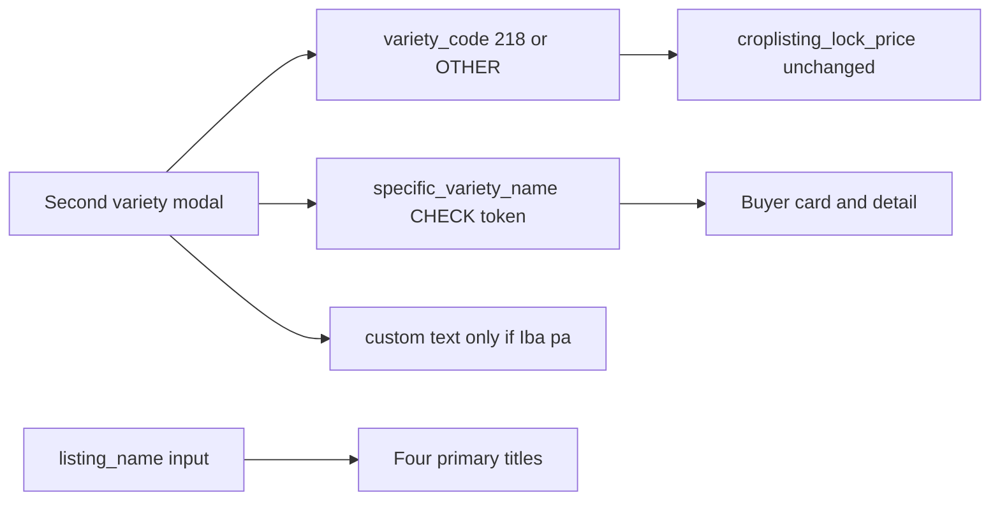

# Add listing_name and specific_variety_name

## Hard gate — do not write application code yet

**This environment cannot run local Postgres right now.** Confirmed just now:

- Docker Desktop is not running (`dockerDesktopLinuxEngine` pipe missing; no Docker processes).
- No `psql` on PATH.
- [`mobile/supabase/config.toml`](mobile/supabase/config.toml) is **not on disk and not in git** (`npx supabase start` from [`mobile/`](mobile/) cannot start a local stack without it).
- Expo is already running against whatever is in `mobile/.env` (`EXPO_PUBLIC_SUPABASE_URL`). That is the database that will break if the client selects/inserts columns that do not exist there — the same failure as last time.

[`mobile/README.md`](mobile/README.md) and [`pricing/README.md`](pricing/README.md) document the intended local path (`cd mobile && npx supabase start`), and `supabase` **is** a mobile devDependency (`^2.113.0`). The CLI exists; the engine and config do not.

**Stop after this plan.** After approval, Phase 0 must happen before any TS/TSX edits:

1. Start Docker Desktop (or say to apply `0024` on the hosted project instead).
2. Restore or generate [`mobile/supabase/config.toml`](mobile/supabase/config.toml) without touching existing migrations (do not `supabase init` over [`mobile/supabase/migrations/`](mobile/supabase/migrations/)).
3. `npx supabase start` (or `db reset`) from `mobile/`, **or** `npx supabase db push` / SQL Editor on the project `EXPO_PUBLIC_SUPABASE_URL` actually uses.
4. Run the SQL constraint tests below against that live instance.
5. Only then write application code.

Conversation-start git status showed a draft `0024` + dirty UI files; **current `tweaks/UI` working tree is clean** and that file is gone. This plan starts from HEAD (`22d108f`).

---

## Confirmed current state (read, not assumed)

**Table:** `public.croplisting` in [`mobile/supabase/migrations/0001_full_data_dictionary_schema.sql`](mobile/supabase/migrations/0001_full_data_dictionary_schema.sql) (lines 269–294).

**Pattern to mirror (TEXT + inline CHECK, not a Postgres ENUM):**

```sql
declared_variety text not null
  check (declared_variety in ('Inbred', 'Hybrid', 'Traditional_or_Heirloom', 'Mix_of_Varieties', 'Others')),
declared_variety_custom text,
constraint croplisting_custom_variety_only_when_others
  check (declared_variety_custom is null or declared_variety = 'Others')
```

Note: UI label **"Iba pa"** for the first modal is stored as **`'Others'`**. For the new field you asked for the stored sentinel to be **`'Iba pa'`** itself — that is the one place we will not copy the `'Others'` token.

**Date column for backfill:** there is **no `created_at`**. Use **`date_listed timestamptz not null default now()`** (same file, line 272).

**Pricing (do not touch):** `variety_code` is `'218' | 'OTHER'`. Trigger `croplisting_lock_price` (0001 lines 720–753) looks up `varietypricepremium` by `variety_code` + grade. Only seed row with a premium is `('218', 'A', 5)`. App mapping in [`mobile/src/types/crop-listing.ts`](mobile/src/types/crop-listing.ts): only `NSIC_Rc218` → `varietyCode: '218'`. First modal, `declared_variety`, WPM ([`marketplace-ranking.ts`](mobile/src/services/marketplace-ranking.ts)), and `varietypricepremium` stay untouched.

**Create form today** ([`creation-listing.tsx`](mobile/src/app/(farmer)/creation-listing.tsx)): required fields are gated by `canSubmit` (button `disabled={!canSubmit}`), not asterisks. Second modal is [`specific-variety-field.tsx`](mobile/src/components/animo/specific-variety-field.tsx). One pick already produces a `SpecificVarietyOption`; **only `variety_code` is persisted**. `specificVarietyCustom` is UI-only and discarded. Custom Iba pa text is currently **optional**.

**Titles today:** `varietyLabel()` (category: Inbred/Hybrid/…) on every card/detail. **Buyer marketplace card has no "May Premium" badge** — that badge exists only on farmer detail and buyer detail (`varietyCode === "218"`).

---

## Schema — new migration `0024_listing_name_specific_variety.sql`

Add to `public.croplisting` only. No ENUM type.

### `listing_name`

- `text`, backfill, then `NOT NULL`.
- Extra `check (btrim(listing_name) <> '')` so `''` is rejected (NOT NULL alone would accept empty string). `declared_variety` does not need this because it is an allow-list.

**Backfill (date from `date_listed`, Asia/Manila calendar date):**

```sql
alter table public.croplisting add column listing_name text;

update public.croplisting
set listing_name = 'Palay Listing (' || to_char(date_listed at time zone 'Asia/Manila', 'YYYY-MM-DD') || ')'
where listing_name is null;

alter table public.croplisting
  alter column listing_name set not null;

alter table public.croplisting
  add constraint croplisting_listing_name_not_blank
  check (btrim(listing_name) <> '');
```

Example: listed 2026-09-10 16:00 UTC → `Palay Listing (2026-09-11)` if that instant is already the 11th in Manila; that is intentional (local listing date).

### `specific_variety_name` + `specific_variety_name_custom`

- **Nullable** `specific_variety_name text` — second modal only appears for Inbred/Hybrid. Traditional / Mix / Others / legacy rows stay `NULL`.
- Allow-list exactly: `Rc218, Rc216, Rc160, Rc222, Rc300, Rc512, Rc508, Rc480, Rc204H, PSB Rc72H, Iba pa` (`NULL` still allowed).
- `specific_variety_name_custom text` nullable.
- Named CHECK mirroring `declared_variety_custom` (one-way): custom is null unless parent = `'Iba pa'`.

```sql
alter table public.croplisting
  add column specific_variety_name text
    check (
      specific_variety_name is null
      or specific_variety_name in (
        'Rc218', 'Rc216', 'Rc160', 'Rc222', 'Rc300', 'Rc512', 'Rc508', 'Rc480',
        'Rc204H', 'PSB Rc72H', 'Iba pa'
      )
    );

alter table public.croplisting
  add column specific_variety_name_custom text;

alter table public.croplisting
  add constraint croplisting_specific_variety_custom_only_when_iba_pa
  check (specific_variety_name_custom is null or specific_variety_name = 'Iba pa');
```

**Iba pa without custom:** the mirrored CHECK does **not** require custom when `'Iba pa'` (same as `declared_variety = 'Others'`). Rejection of blank custom happens in **`canSubmit` + `createCropListing`**, same as the existing Others field. Raw SQL `specific_variety_name = 'Iba pa'` with `custom is null` would still succeed — that is the existing pattern. If Claude wants that SQL insert to fail too, we can tighten to a two-way CHECK after approval; that would be stricter than `declared_variety_custom`.

No backfill for specific variety (unknown for legacy rows).

---

## Option value mapping (one pick, two fields)

Keep **labels** as they are so the second modal and buyer-preferences (which match **by label**) do not break. Change **`option.value`** to the CHECK tokens and keep **`varietyCode` exactly as today**:

| value (new, stored) | label (unchanged) | varietyCode |
|---|---|---|
| `Rc218` | NSIC Rc218 | `'218'` |
| `Rc216` | NSIC Rc216 | `'OTHER'` |
| `Rc160` … `Rc480` | NSIC Rc… | `'OTHER'` |
| `Rc204H` | Mestizo 20 (NSIC Rc204H) | `'OTHER'` |
| `PSB Rc72H` | Mestizo 1 (PSB Rc72H) | `'OTHER'` |
| `Iba pa` | Iba pa | `'OTHER'` |

`SPECIFIC_VARIETY_OTHER` becomes `'Iba pa'` (today `'Others_Specific'`). [`buyer-preferences-form.tsx`](mobile/src/components/animo/buyer-preferences-form.tsx) stores `option.label` / custom text, not `option.value`, so this is safe if labels stay put.

Create submit (Inbred/Hybrid): same selection writes `variety_code` (unchanged derivation) **and** `specific_variety_name = option.value`, plus custom only when `'Iba pa'`. Non-Inbred/Hybrid: `specific_variety_name` / custom `null`, `variety_code = 'OTHER'`.

---

## Application files (only after Phase 0 SQL tests pass)

### Data path

- [`mobile/src/types/crop-listing.ts`](mobile/src/types/crop-listing.ts) — option `value`s; `CreateCropListingInput` + `CropListing` gain `listingName`, `specificVarietyName`, `specificVarietyNameCustom`; helpers `listingTitle()` and `specificVarietyDisplay()` (Iba pa → custom; else look up existing **label** so Hybrid still reads "Mestizo 20 (NSIC Rc204H)", not the terse token). `varietyLabel()` stays category-only for "Uri ng palay" specs, filters, WPM, receipts.
- [`mobile/src/services/crop-listing-service.ts`](mobile/src/services/crop-listing-service.ts) — `CropListingRow`, `LISTING_COLUMNS`, `mapListing`, insert + the same custom-required guard used for Others. [`marketplace-service.ts`](mobile/src/services/marketplace-service.ts) uses `LISTING_COLUMNS` / `mapListing` — covered automatically.

### Create form

- [`mobile/src/app/(farmer)/creation-listing.tsx`](mobile/src/app/(farmer)/creation-listing.tsx)
  - `LabeledInput` **Pangalan ng Listing** directly above **Uri ng Palay** (~line 304).
  - `canSubmit`: `listingName.trim().length > 0`; if Iba pa, `specificVarietyCustom.trim().length > 0` (drop "(opsyonal)").
  - Pass both new fields into `createCropListing`. Do not change `varietyCode` derivation (lines 92–96).

[`specific-variety-field.tsx`](mobile/src/components/animo/specific-variety-field.tsx) itself does not need edits.

### Display (specified surfaces only)

- Farmer card [`palengke.tsx`](mobile/src/app/(farmer)/(tabs)/palengke.tsx) ~543: title → `listingTitle()`. Also add `listingName` to `listingMatchesSearch` (~149) so the new title is searchable.
- Farmer detail [`listing-detail-content.tsx`](mobile/src/components/animo/farmer/listing-detail-content.tsx) ~192–198: title → `listingTitle()`; **keep** `May Premium`; **add** specific variety next to it. SpecBox "Uri ng palay" stays `varietyLabel()` (category).
- Buyer card [`marketplace-listing-card.tsx`](mobile/src/components/animo/buyer/marketplace-listing-card.tsx): title → `listingTitle()`. **There is no Premium badge here today** — add specific-variety text (spec/chip). Hide that row when the column is null (legacy / non-Inbred/Hybrid).
- Buyer detail [`palengke/[id].tsx`](mobile/src/app/(buyer)/palengke/[id].tsx) ~275–280: title → `listingTitle()`; **remove** `May Premium`; show specific variety text instead. SpecBox "Uri ng palay" stays category.

Buyer palengke search ([`palengke/index.tsx`](mobile/src/app/(buyer)/palengke/index.tsx) ~205): include `listingName` in the haystack (same reason as farmer search).



---

## Explicitly out of scope (unless Claude says otherwise)

Do not change: first variety modal, `declared_variety*`, `croplisting_lock_price`, `varietypricepremium`, WPM ranking, buyer preferences persistence, receipts/transactions/bid/request cards (`varietyLabel` remains the category there), farmer-public-profile "commonly sold" chips.

---

## Verification (must be against a real Postgres, then the app)

**SQL (after `0024` is applied):**

1. Empty `listing_name` (`''` / whitespace) — rejected by not-blank CHECK.
2. `specific_variety_name = 'Rc216'` with custom text — rejected by custom CHECK.
3. `specific_variety_name = 'NotARealVariety'` — rejected by allow-list.
4. `Rc218` + `variety_code = '218'` + grade `A` — `computed_price_per_kg` = latest `marketpricefeed` dry/wet base **+ 5**. Confirm `croplisting_lock_price` source is unchanged.
5. `Rc216` (or Iba pa) + `variety_code = 'OTHER'` — premium 0 (OTHER/Ungraded fallback).
6. NULL `specific_variety_name` (Traditional-style row) — allowed.

**App (only after the DB the Expo `.env` points at has `0024`):**

1. Submit blocked without listing name; name appears as title on all four surfaces.
2. Inbred/Hybrid without specific pick still blocked; Iba pa without custom blocked; non-Iba pa clears custom.
3. Rc218 still premium on farmer detail; buyer detail shows variety name, not May Premium.
4. Buyer card shows variety text, not a premium-only badge.
5. Traditional/Mix/Others: no specific variety stored; titles still work.
6. Hosted/legacy rows: `Palay Listing (YYYY-MM-DD)` from `date_listed`; no crash when specific variety is null.

If Phase 0 is hosted-only, run the SQL tests in the Supabase SQL Editor of **that** project before any client change.
